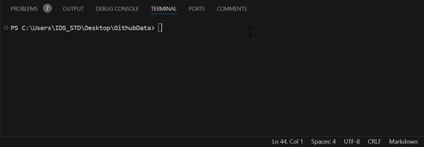

# GitHub Repository Scraper


**GitHub Repository Scraper** is a Python-based tool that helps you search for GitHub repositories based on specific criteria, such as programming language, star count, and more. It uses the GitHub API to fetch data and presents it in a user-friendly terminal interface, enhanced by the `rich` library for better visuals.


## ✨ Features
- **Search GitHub Repositories**: Find repositories by entering a keyword or topic (e.g., "AI").
- **Filter Results**: Narrow down results by programming language, star count, or forks.
- **Save Results**: Save the search results to files in multiple formats:
  - CSV (for spreadsheets)
  - JSON (for structured data)
  - SQLite (for database storage)
  - Excel
- **Enhanced Visuals**: Enjoy clear progress bars, tables, and color-coded outputs in the terminal.

## 📚 Table of Contents
- [Features](#-features)
- [Installation](#-installation)
- [Usage](#-usage)
- [Examples](#-examples)
- [Requirements](#-requirements)
- [Contributing](#-contributing)
- [Future Enhancements](#-future-enhancements)
- [License](#-license)


## 🛠 Installation
### Step 1: Clone the Repository
This downloads the project files to your local computer.

1. Open a terminal (Command Prompt, PowerShell, or Terminal on Mac/Linux).
2. Run the following command:
   ```bash
   git clone https://github.com/srifsky/github-scraper.git
   ```
3. Navigate into the project folder:
   ```bash
   cd github-scraper
   ```


### Step 2: Install Python and Dependencies
Ensure you have Python installed on your system (version 3.7 or higher).

1. **Check if Python is installed**:
   ```bash
   python --version
   ```
   If Python is not installed, download and install it from [python.org](https://www.python.org/).

2. **Install Required Libraries**:
   Use `pip` to install the libraries listed in `requirements.txt`:
   ```bash
   pip install -r requirements.txt
   ```

### Step 3: Set Up Environment Variables
The script uses the GitHub API, which requires a **Personal Access Token** for authentication.

1. **Generate a GitHub Personal Access Token**:
   - Go to your GitHub account settings: [Generate Token](https://github.com/settings/tokens).
   - Click "Generate new token."
   - Select permissions like `repo` and `read:org`.
   - Copy the token (keep it safe; you won’t see it again).

2. **Create a `.env` File**:
   - In the project folder, create a file named `.env`.
   - Add the following line to the file:
     ```plaintext
     GITHUB_TOKEN=your_personal_access_token
     ```
   Replace `your_personal_access_token` with your actual GitHub token.

---


## 🎯 Usage
Run the script in your terminal to start searching GitHub repository data.

1. **Start the Script**:
   ```bash
   python github_scraper.py
   ```

2. **Follow the Prompts**:
   - Enter the keyword or topic you want to search for (e.g., "AI").
   - Specify additional filters, like programming language (optional).
   - Choose how to sort results (e.g., by stars).
   - Select the output format (e.g., CSV, JSON, SQLite, or Excel).

3. **Example Search**:
   - **Query**: "AI"
   - **Filter**: Programming Language: "Python"
   - **Sort by**: Stars
   - **Order**: Descending
   - **Save Format**: CSV


## Example Input

### Search for AI repositories:

- **Query**: ai  
- **Filter**: Language: Python  
- **Sort by**: stars  
- **Order**: desc  
- **Save format**: CSV  

#### Example Output:
```plaintext
Fetching pages: 100%|██████████| 3/3 [00:05<00:00,  1.20s/it]
Saved CSV to data/github_api_results.csv
```
### Saved File:
The search results will be saved in the `data` folder of your project in the format you selected.


## Visual Example
Here’s how the script looks in action:




## 🔧 Requirements
- **Python**: Version 3.7 or higher
- **Dependencies**: Installed via `requirements.txt`


## 🤝 Contributing
Feel free to submit issues or pull requests for new features or improvements.


## 🌐 Connect with Us
- **GitHub**: [srifsky](https://github.com/srifsky)
- **Email**: [sharif.w@ids.ac.th](mailto:sharif.w@ids.ac.th)


## 🌟 Future Enhancements
- Add support for fetching repository contributors and their stats.
- Include a web-based dashboard using Streamlit or Dash for interactive analysis.
- Expand filtering options (e.g., by creation date, issue count).


## 📜 License
This project is licensed under the Creative Commons Attribution-NonCommercial 4.0 International Public License. See the `LICENSE` file for details.
